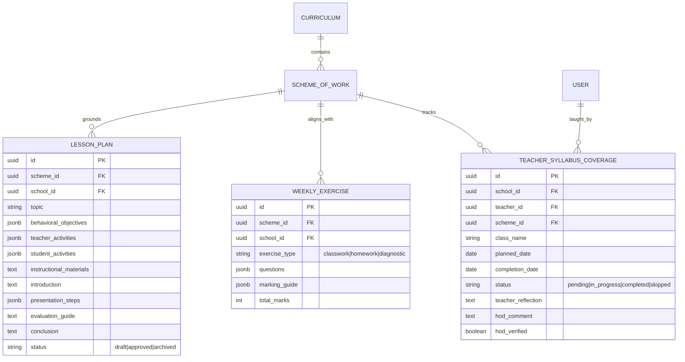

# SkuPhase: Unified System Audit, Implementation Plan & Strategic Roadmap

---

## Executive Summary

SkuPhase has established a solid, functional baseline: a curriculum-first, multi-tenant assessment generation platform tailored to the Nigerian educational context (NERDC). It features school data isolation, durable background generation jobs with retry recovery, PDF/DOCX export pipelines, a question bank, offline-friendly PWA capabilities, and visual reasoning card generators.

However, cross-evaluating the external architectural audits (GPT and DeepSeek) against the live codebase confirms that **SkuPhase is not yet complete as an enterprise assessment platform, a secondary school science suite, or a sellable partner API**. 

This comprehensive master document delivers:
1. **Part I: Unified Forensic Audit**: Verified code-level findings strictly segregated from proposals, confirming critical blockers, high-risk security items, and architecture gaps with exact file/line citations.
2. **Part II: Implementation Plan for Verified Fixes**: A prioritized, actionable engineering plan (Phases 0–3) bringing the core engine and manual authoring studio to release-grade maturity.
3. **Part III: Categorized Suggestions & Proposals**: An exhaustive, phased catalog of forward-looking capabilities with explicit provenance tags (`[GPT]`, `[DeepSeek]`, `[Antigravity]`) and overlap highlights.
4. **Part IV: Architectural Roadmap for Weekly Lesson Notes, Exercises & Teacher Learning Paths**: A concrete technical blueprint leveraging the existing NERDC database to expand SkuPhase into everyday classroom delivery and administrative syllabus tracking.
5. **Part V: Audit Synthesis, Accuracy Corrections & Architectural Guardrails**: Reconciliation of DeepSeek's 49-point audit evaluation, a reviewable table of code citations and corrections, and the critical architectural decoupling guardrail for commercial SMS/API viability.

---

# Part I: Unified Forensic Audit (Codebase Reality vs. Audit Findings)

> [!IMPORTANT]
> **Strict Segregation Notice**: Part I contains **only verified audit findings and code realities**. No suggestions, speculative enhancements, or proposals are mixed into this section.

### Summary Verdict Table

| # | Audit Item | Reported Severity | Verification Status | Verified Code Location / Evidence |
|---|---|---|---|---|
| **1** | Deployment / CI Dependency Failure | Critical Blocker | **CONFIRMED** | `requirements.txt:55-60`, `pyproject.toml:10`, `.github/workflows/ci.yml:26` |
| **2** | Silent Diagram Loss in PDF Exports | Critical Blocker | **CONFIRMED** | `app/services/export_service.py:39-61` (`svglib` not declared/installed; silent fallback) |
| **3** | Manual Exam Composer Truncation | High Defect | **CONFIRMED** | `app/frontend/routes/exams.py:5309-5315` & `5497-5502` vs `app/schemas/exam.py:442` |
| **4** | Raw SVG Injection & XSS Vulnerability | High Security | **CONFIRMED** | `app/frontend/components/exam.py:319` (`NotStr(diagram_svg)`), `app/frontend/middleware.py:96` |
| **5** | LaTeX Rendering Parity Gap (Web vs PDF) | High Fidelity | **CONFIRMED** | `export_service.py:115-165` (Regex text approximations vs browser KaTeX) |
| **6** | School Logo Resolution & CSP Blocking | Medium Defect | **CONFIRMED** | `export_service.py:330-344` (`Path(...).is_file()`), `middleware.py:94` |
| **7** | Secondary Science Curriculum Void | Medium Scope | **CONFIRMED** | `data/nerdc_scheme_database.final.json` (3,081 rows: Pre-Nursery to Primary 6 only) |
| **8** | Subject Taxonomy Inconsistency | Medium Architecture | **CONFIRMED** | Duplicated across 6 files (`curriculum.py`, `exams.py`, `bank.py`, `proposals.py`) |
| **9** | Partner API Productization Missing | Medium Architecture | **CONFIRMED** | `app/api/v1/*` (Internal UI session endpoints; no API keys, rate limits, or webhooks) |
| **10** | LLM Cost Logging & Model Key Drift | Low/Medium | **CONFIRMED** | `app/config/settings.py:89` (`qwen/qwen3.8-27b` missing from `GROQ_MODELS`) |
| **11** | Test Gate & Flaky Export Assertions | Medium Reliability | **CONFIRMED** | `tests/test_export_service.py`, missing golden-file PDF tests, static ruff backlog |

---

### Deep-Dive Analysis of Verified Audit Findings

#### 1. Deployment & CI Dependency Failure (Confirmed Blocker)
* **Finding**: `requirements.txt` explicitly excluded `python-fasthtml`, `faststrap`, `svglib`, `bleach`, and `markdown` (lines 55–60 note they were removed in legacy cleanup). Additionally, `pyproject.toml` declares `dependencies = []` on line 10.
* **Evidence**: In `app/main.py:74`, the frontend is mounted via `from app.frontend.app import frontend_app`. When CI runs `.github/workflows/ci.yml` (`pip install -r requirements.txt && pytest`), fresh container environments crash on import with `ModuleNotFoundError: No module named 'fasthtml'`.
* **Impact**: The repository cannot be deployed to clean infrastructure or pass GitHub Actions without pre-baked environment workarounds.

#### 2. Silent Diagram Loss in PDF Exports (Confirmed Blocker)
* **Finding**: `app/services/export_service.py` attempts to import `from svglib.svglib import svg2rlg` inside `_svg_to_flowable()` to embed visual reasoning diagrams into ReportLab PDFs.
* **Evidence**: Lines 39–61 wrap the conversion in `try ... except Exception: return None`. Because `svglib` is not in `requirements.txt` and not installed in standard runners, all diagrams fail silently and return `None`.
* **Impact**: Generated exam PDFs for visual reasoning or primary mathematics omit the question figures entirely, producing blank diagram viewports on printed papers without logging an error.

#### 3. Manual Exam Composer Functional Truncation (Confirmed High Defect)
* **Finding**: The manual composer at `/app/exams/new/manual` is advertised as a full alternative to AI generation, but it strips essential assessment fields.
* **Evidence**:
  * In `app/frontend/routes/exams.py:5309-5315`, the client-side JavaScript serializes only: `question_number`, `type`, `question_text`, `marks`, and `options`.
  * It completely omits `correct_answer`, `marking_scheme`, `explanation`, `sub_parts`, `topic`, `difficulty`, `bloom_level`, and `diagram_svg`.
  * In `app/frontend/routes/exams.py:5497-5502`, the server handler discards non-matching fields and silently converts `fill_in_blank` to `short_answer`.
  * Manual papers have **no section support**, meaning teachers cannot express the standard Nigerian examination structure ("Section A: answer all; Section B: answer any 3 of 5").
  * In contrast, the backend schema `ManualQuestionInput` in `app/schemas/exam.py:442` and `SectionConfig` already support all these fields.
* **Impact**: Teachers creating manual exams cannot generate an answer key, marking guide, sub-parts, or structured sections for MCQs, True/False, or Theory.

#### 4. Raw SVG Injection & Stored XSS Vulnerability (Confirmed High Security)
* **Finding**: Question diagrams are inserted directly into the DOM using raw unescaped strings.
* **Evidence**:
  * `app/frontend/components/exam.py:319`: `NotStr(diagram_svg)` inserts SVG markup without sanitization.
  * `app/frontend/middleware.py:96`: Content Security Policy header sets `script-src 'self' 'unsafe-inline' https://cdn.jsdelivr.net;`.
* **Impact**: If an exam contains SVG generated by an external LLM, imported via question bank, or authored by a teacher containing `<script>` or `onload=` event handlers, the browser executes it in the teacher/admin security context.

#### 5. LaTeX Rendering Parity Gap (Confirmed High Defect)
* **Finding**: Web UI math rendering is handled by KaTeX + mhchem CDN, while ReportLab PDF export uses rudimentary regex replacement rules.
* **Evidence**:
  * `app/services/export_service.py:115-165` uses regex to turn `\frac{a}{b}` into `(a/b)` and strips `\text{...}`, `\mathrm{...}`.
  * Matrices (`\begin{matrix}`), chemical equations (`\ce{H2SO4}` beyond basic subscripts), square roots with indices, system equations, and multi-line workings are not converted to ReportLab flowables.
* **Impact**: An equation that renders equations crisply in the browser displays as raw LaTeX syntax or garbled text when printed to PDF.

#### 6. School Logo Resolution & CSP Blocking (Confirmed Medium Defect)
* **Finding**: School logos routinely fail to appear on exported exam headers.
* **Evidence**:
  * `app/services/export_service.py:330-344` tests `Path(lpath).is_file()`. In production, `school_logo_path` is frequently a relative web path or URL, which fails local path checks.
  * `app/frontend/middleware.py:94` restricts `img-src 'self' data: https://cdn.jsdelivr.net;`, blocking external school logos hosted on CDNs. Note: Fetching remote logos requires strict host validation to prevent Server-Side Request Forgery (SSRF).

#### 7. Secondary Science Curriculum Gap (Confirmed Medium Scope)
* **Finding**: SkuPhase's NERDC database (`data/nerdc_scheme_database.final.json`) contains 3,081 records covering Pre-Nursery through Primary 6.
* **Evidence**: Junior Secondary (JSS 1–3) and Senior Secondary (SSS 1–3) are absent from the dataset. While the UI dropdown permits selecting Physics, Chemistry, Biology, and Further Mathematics, the AI generator has no scheme of work, topics, or behavioral objectives to ground them.
* **Impact**: Senior secondary exam generation relies purely on parametric LLM knowledge without curriculum grounding, violating the core "curriculum-first" premise.

#### 8. Subject Taxonomy Fragmentation (Confirmed Medium Architecture)
* **Finding**: Subject names are hardcoded in six separate files with conflicting vocabularies:
  * `curriculum.py:45`, `exams.py:1020`, `exams.py:3537`, `exams.py:5453-5458`, `bank.py:186`, `proposals.py:516`.
  * The manual route offers *National Values, Civic Education, Computer Studies, Home Economics, Islamic Religious Studies*, while the seeded curriculum has *Social & Citizenship Studies, Basic Digital Literacy, Islamic Studies, Prevocational Studies*.
* **Impact**: Manual exams cannot be reliably mapped to scheme-of-work weeks, and questions stored in the bank cannot be filtered cleanly against the curriculum.

#### 9. Partner API Productization Missing (Confirmed Medium Architecture)
* **Finding**: The routes under `app/api/v1/` serve the internal FastHTML web client, not an external API ecosystem.
* **Evidence**:
  * Authentication requires session cookies or bearer JWTs issued from user credentials; there is no tenant API key provisioning, webhook dispatcher, idempotency header handling, or rate-limiting tiers.
  * The frontend settings page (`app/frontend/routes/settings.py:248`) explicitly labels API Access as "Coming Soon".

---

# Part II: Actionable Implementation Plan (Priority Fixes)

```mermaid
flowchart TD
    subgraph Phase 0: Core Stability & Release Gate
        P0_A[Pin Dependencies in requirements.txt & pyproject.toml] --> P0_B[Fix svglib & Faststrap SVG Sanitizer]
        P0_B --> P0_C[Fix School Logo Local Paths & Safe CSP]
        P0_C --> P0_D[Pass CI Pipeline & Add Golden-File PDF Tests]
    end

    subgraph Phase 1: Assessment Studio Workshop
        P1_A[Add Sections & Rubric Semantics to Composer] --> P1_B[Answer Keys, Mark Schemes & Given Data Block]
        P1_B --> P1_C[Expose 10 Existing Diagram Archetypes as Pickers]
        P1_C --> P1_D[Inline Bank Pull/Push & Curriculum Week Tagging]
        P1_D --> P1_E[Faststrap Live Split-Screen with htmx:afterSwap KaTeX]
    end

    subgraph Phase 2: Secondary Curriculum & Diagram Engine
        P2_A[Ingest JSS 1-3 & SSS 1-3 NERDC Data] --> P2_B[Multi-Board Selector: NERDC, Lagos Unified, WAEC]
        P2_B --> P2_C[Unify Subject Taxonomy from Single API]
        P2_C --> P2_D[Server-Side LaTeX to SVG to PDF Pipeline]
    end

    subgraph Phase 3: Commercial Partner API & Gateway
        P3_A[API Key Management & Scoped Roles] --> P3_B[HMAC Webhook Delivery & Idempotency Keys]
        P3_B --> P3_C[Public OpenAPI / Scalar Portal]
    end

    Phase 0 --> Phase 1 --> Phase 2 --> Phase 3
```

### Phase 0: Core Stability & Release Gate (Immediate)
1. **Declare All Production Dependencies**:
   - Update `requirements.txt` and `pyproject.toml` (line 10) to declare: `fasthtml`, `faststrap`, `svglib`, `bleach`, `markdown`, `pydantic-settings`.
   - Ensure clean `pip install -r requirements.txt` on Ubuntu Linux and Windows passes without missing modules.
2. **Robust SVG Sanitization**:
   - Wrap `diagram_svg` in `app/frontend/components/exam.py` with Faststrap's `render_svg()` or `bleach.clean()` with strict tag and protocol allowlists (`svg`, `path`, `g`, `circle`, `rect`, `line`, `text`, `polygon`, `defs`), rejecting `script`, `style` overlay attributes, `on*` handlers, and remote `xlink:href`.
3. **School Logo Resolution & SSRF-Safe Loading**:
   - Update `export_service.py:330-344` to resolve static relative assets against the local filesystem.
   - For remote logos, implement a safe fetcher (strict HTTPS, host allowlist, private IP rejection, 500KB cap) or enforce local file upload to avoid SSRF vulnerabilities.
4. **CI Green & Golden-File PDF Tests**:
   - Resolve existing test mismatches in `tests/test_export_service.py`.
   - Add golden-file PDF regression tests (`F-3`) verifying that visual reasoning SVG diagrams actually render as ReportLab drawings, preventing silent regressions.

---

### Phase 1: Assessment Studio Workshop (Manual Authoring Upgrade)
1. **Sections & Rubric Semantics (`A-5`)**:
   - Upgrade the manual composer to support sections matching `SectionConfig`:
     - Section title, instructions (`instruction_type`: `answer_all`, `answer_any_n`, `compulsory_plus_optional`).
     - `answer_count`, `marks_per_question`, `sub_part_style` (`alphabetic`, `roman`, `numeric`).
   - Ensures manual papers have first-class parity with AI-generated papers.
2. **Answer Keys, Explanations & Given-Data Block (`A-2`, `A-4`)**:
   - Provide radio-button correct answer selection for MCQs and True/False.
   - Add structured marking schemes (step-by-step scoring criteria) and explanations.
   - Add a distinct "Given Data / Constants" block for Science/Maths problems.
3. **Parametric Diagram Picker Reusing Existing 10 Archetypes (`A-3`)**:
   - Do NOT defer diagrams! Wire up the **10 hand-built, print-tested Nigerian archetypes** already in `app/services/diagram_templates.py`:
     1. Horizontal Y-Fork (Circle $\rightarrow$ 2 Boxes)
     2. Fraction Branch Tree
     3. M-Shape Network
     4. Power-Circle + Box + Fork
     5. 4-Way Compass Cross
     6. Horseshoe (U-Shape)
     7. Arc (C-Shape)
     8. 2x2 Grid with Ear Bubble
     9. T-Bar Multiplier
     10. Triangle Puzzle
   - Teachers select an archetype, fill in the slot numbers/labels, choose the missing target (`?`), and click "Insert Diagram". The diagram instantly appears in the question preview.
4. **Inline Question Bank Integration (`A-6`) & Curriculum Tagging (`A-7`)**:
   - Provide an "Import from Bank" drawer and "Save to Bank" checkbox on each card.
   - Allow teachers to tag questions with Curriculum Week and Subtopic.
5. **Structural Operations & Full Paper Preview (`A-8`)**:
   - Drag-to-reorder questions, duplicate question card, bulk marks recalculation.
6. **Live Split-Screen with `htmx:afterSwap` KaTeX Hook (`A-1`)**:
   - Faststrap dual-pane layout: Live KaTeX math preview on the right with construct shortcuts (fractions, surds, matrices, `\ce{}` chemistry).
   - Hook into `document.body.addEventListener('htmx:afterSwap', ...)` to trigger KaTeX re-rendering on dynamic card updates.

---

### Phase 2: Secondary School & Science Expansion
1. **Curriculum Ingestion (JSS 1–3 & SSS 1–3)**:
   - Ingest NERDC schemes for: General Mathematics, Further Mathematics, Physics, Chemistry, Biology, and Agricultural Science.
2. **Multi-Board Curriculum Selector (`C-3`)**:
   - Enable switching between `NERDC (National)`, `Lagos State Unified Schemes`, and `WAEC/NECO Syllabi`.
   - Leverage the existing `curriculums.board` database column.
3. **Single Source of Truth for Subjects (`C-2`)**:
   - Refactor all 6 hardcoded subject lists to fetch dynamically from `/api/v1/curriculum/subjects`.
4. **Server-Side LaTeX-to-PDF Parity Engine (`B-2`)**:
   - Implement KaTeX/MathJax $\rightarrow$ SVG $\rightarrow$ `svglib` $\rightarrow$ ReportLab, or a Typst/WeasyPrint rendering pipeline. Completely eliminates equation mangling on printed papers.
5. **Parametric Secondary Science Diagram Library (`B-3`)**:
   - Expand diagram templates to include electric circuits, optical ray diagrams, laboratory apparatus (burette, Liebig condenser), and biological cell structures.

---

### Phase 3: Commercial Partner API Productization
1. **Tenant API Keys & Scopes (`D-1`)**:
   - Add `ApiKey` model with SHA-256 hashing, expiration, IP whitelisting, and permission scopes (`exams:read`, `exams:generate`, `curriculum:read`).
2. **Webhook Infrastructure & Idempotency (`D-2`, `D-4`)**:
   - Signed asynchronous HMAC webhooks (`exam.generation.completed`, `exam.generation.failed`) with exponential backoff.
   - Enforce `Idempotency-Key` headers on exam generation endpoints.
3. **Public API Portal & Embeddable Renderer (`D-3`)**:
   - Interactive OpenAPI / Scalar documentation.
   - Lightweight embeddable paper preview widget for partner SMS platforms.

---

# Part III: Categorized Suggestions & Proposals (Phased & Attributed)

> [!NOTE]
> Each proposal below is strictly tagged with its origin:
> - `[GPT]` = Proposed in the GPT external audit
> - `[DeepSeek]` = Proposed in the DeepSeek external audit
> - `[Antigravity]` = Proposed by Google DeepMind Antigravity engineering
> - `[GPT + DeepSeek]` = Independent consensus between both external audits
> - `[All]` = Universal consensus across all three sources

---

### Category A: Visual Reasoning, Mathematics & Diagram Engine

#### 1. Universal Question Document Schema `[GPT + DeepSeek]`
* **Proposal**: Transition from flat question text to a structured block model (`DocumentBlock`: Text, MathBlock, SvgBlock, TableBlock, CodeBlock).
* **Rationale**: Decouples presentation from data; ensures identical rendering across Web, PDF, DOCX, and external API consumers.

#### 2. Server-Side LaTeX Parity Engine `[All]`
* **Proposal**: Replace regex replacements in `export_service.py` with a headless rendering engine (Server-side KaTeX/MathJax $\rightarrow$ SVG $\rightarrow$ `svglib` $\rightarrow$ ReportLab Flowable, or Typst/WeasyPrint).
* **Rationale**: Completely eliminates equation mangling on printed PDF examination papers.

#### 3. Standardized Science Diagram Library `[DeepSeek + Antigravity]`
* **Proposal**: Build a curated, parameterized SVG template catalog for West African secondary examinations:
  * **Physics**: Optics rays, inclined planes, resistor networks, pulley systems, ticker timers.
  * **Chemistry**: Organic skeletal structures, laboratory distillation setups, periodic table extracts.
  * **Biology**: Flower anatomy, mammalian heart, cell organelles, food webs with customizable labels.
  * **Mathematics**: Histograms, Venn diagrams, pie charts, trigonometric unit circles.

#### 4. Faststrap Rich Formula & Symbol Bar `[DeepSeek + Antigravity]`
* **Proposal**: Add a Faststrap-styled visual symbol bar to the manual composer with common West African exam symbols ($\theta, \alpha, \lambda, \Omega, \int, \sum, \pm, \sqrt{}, \rightarrow, \rightleftharpoons, \mu, \pi, \frac{d}{dx}$) and math constructs (matrices, surds, chemical equations).

#### 5. Formula and Constant Bank (`B-7`) `[DeepSeek]`
* **Proposal**: Provide a verified database of West African scientific constants ($g = 9.8\text{ or }10\text{ m/s}^2, c = 3.0\times 10^8\text{ m/s}, N_A = 6.02\times 10^{23}$, atomic masses $\text{H}=1, \text{C}=12, \text{O}=16, \text{Na}=23$).
* **Rationale**: Ensures AI and teachers use standardized examination constants without manual lookup errors.

---

### Category B: Teacher Authoring Experience & Workflow

#### 1. Comprehensive Question Composer (Answer Keys & Mark Schemes) `[All]`
* **Proposal**: Upgrade the manual editor to support multi-part questions (e.g., Question 1a, 1b, 1c), teacher marking guides, partial credit breakdowns, and explicit correct answer tags.

#### 2. Hybrid AI Co-Pilot ("Assist Me" Feature) `[DeepSeek + Antigravity]`
* **Proposal**: Allow teachers in the manual editor to write a rough question or topic, then click "AI Suggest Diagram", "AI Generate Options", or "AI Draft Marking Guide".
* **Rationale**: Merges manual pedagogical control with AI velocity.

#### 3. Question Bank Ingestion & Export (CSV, Word, GIFT, QTI) `[GPT + DeepSeek]`
* **Proposal**: Support standard assessment formats: import existing exams from DOCX/CSV and export to LMS formats (Canvas, Moodle GIFT, QTI 2.1).

#### 4. OMR Sheet Generation & Mobile Grading Assistance `[DeepSeek + Antigravity]`
* **Proposal**: Generate personalized printable bubble sheets (OMR) corresponding to generated MCQs, paired with camera-based grading or manual fast-entry scoring.

#### 5. Table of Specification / Exam Blueprint Generator (`G-3`) `[DeepSeek]`
* **Proposal**: A visual matrix mapping curriculum topics against Bloom's cognitive taxonomy levels (Knowledge, Understanding, Application, Analysis, Synthesis, Evaluation) to guarantee balanced exam coverage before generation.

---

### Category C: Partner API & Platform Commercialization

#### 1. Developer Portal & Self-Service API Keys `[GPT + DeepSeek]`
* **Proposal**: Enable third-party EdTechs and School Management Systems to generate assessment papers programmatically via a scoped REST API.

#### 2. Webhook Event Bus for Asynchronous Jobs `[All]`
* **Proposal**: Dispatch durable events (`generation.queued`, `generation.completed`, `export.ready`) to partner endpoints.

#### 3. White-Label Multi-Tenant Export Engine `[GPT + Antigravity]`
* **Proposal**: Allow partner school management systems to pass their custom institution branding, header layouts, watermark configurations, and custom fonts via API payload.

#### 4. Embeddable Paper Preview Widget (`D-3`) `[DeepSeek]`
* **Proposal**: A zero-install lightweight iframe / JS widget allowing partner portals to display live, interactive KaTeX/SVG exam papers directly inside their own dashboards.

---

### Category D: Long-Term School Management System (SMS) Modules

#### 1. Foundation Prerequisite Models (`E-1`, `E-2`, `E-3`) `[DeepSeek]`
* **Proposal**: Establish the fundamental entity hierarchy prior to launching gradebook features:
  * `AcademicSession` (e.g. 2026/2027) & `Term` (First, Second, Third).
  * `ClassStream` (e.g. JSS 2 Gold, Primary 4B).
  * `Student` & `Enrollment` records.
  * `GradeScale` (e.g. WAEC A1–F9 or Primary Distinction/Credit/Pass).

#### 2. Continuous Assessment (CA) & Cumulative Report Card Engine `[DeepSeek + Antigravity]`
* **Proposal**: Link exam generation results directly to student termly grade sheets (1st CA 10%, 2nd CA 10%, 3rd CA 20%, Final Exam 60%), generating compliant cumulative report sheets.

#### 3. Question Performance & Item Analysis `[DeepSeek]`
* **Proposal**: Record student score distribution per question to determine difficulty index, discrimination index, and distractor efficiency.

#### 4. Administrative Quality & Moderation Workflow `[GPT + Antigravity]`
* **Proposal**: Role-based approval pipeline: Subject Teacher drafts exam $\rightarrow$ Head of Department (HOD) moderates $\rightarrow$ Principal signs off $\rightarrow$ Printable package locked with audit watermark.

---

# Part IV: Architectural Expansion Roadmap: Weekly Lesson Notes, Exercises & Teacher Learning Paths

### Vision & Problem Definition
Schools in Nigeria operate strictly on weekly schemes of work. While exams occur at midterm and term-end, teachers spend 80% of their operational time preparing **weekly lesson notes, diagnostic exercises, and homework assignments**. Furthermore, school administrators struggle with **syllabus coverage auditing**—verifying whether teachers actually covered Week 4's topic before testing students on it.

Because SkuPhase already stores the canonical **NERDC Scheme of Work** down to term, week, topic, and subtopics, it has the exact foundation to become the comprehensive classroom operating system.

---

### 1. Data Model Extension Architecture



#### Database Models (SQLAlchemy & PostgreSQL)

```python
# app/models/learning_delivery.py

import uuid
from sqlalchemy import Column, String, Integer, Boolean, ForeignKey, Text, Date, Index
from sqlalchemy.dialects.postgresql import UUID, JSONB
from sqlalchemy.orm import relationship
from app.models.base import BaseModel

class LessonPlan(BaseModel):
    """Weekly NERDC-aligned lesson note prepared by teacher or generated by AI."""
    __tablename__ = "lesson_plans"

    id = Column(UUID(as_uuid=True), primary_key=True, default=uuid.uuid4)
    school_id = Column(UUID(as_uuid=True), ForeignKey("schools.id", ondelete="CASCADE"), nullable=False, index=True)
    scheme_id = Column(UUID(as_uuid=True), ForeignKey("scheme_of_works.id", ondelete="CASCADE"), nullable=False, index=True)
    teacher_id = Column(UUID(as_uuid=True), ForeignKey("users.id", ondelete="SET NULL"), nullable=True)

    # Core Pedagogy Content (NERDC Standard Format)
    duration_minutes = Column(Integer, default=40, nullable=False)
    instructional_materials = Column(Text, nullable=True)  # Teaching aids (charts, realia, beaker)
    previous_knowledge = Column(Text, nullable=True)
    behavioral_objectives = Column(JSONB, default=list, nullable=False) # ["By the end of the lesson, pupils should be able to..."]
    
    # 5-Step Delivery Flow
    introduction = Column(Text, nullable=True)
    presentation_steps = Column(JSONB, default=list, nullable=False) # [{"step": 1, "title": "Definition", "teacher_activity": "...", "pupil_activity": "..."}]
    summary = Column(Text, nullable=True)
    evaluation_questions = Column(JSONB, default=list, nullable=False) # Rapid oral/written check questions
    assignment = Column(Text, nullable=True)

    status = Column(String(20), default="draft", nullable=False) # draft, submitted, approved
    approved_by = Column(UUID(as_uuid=True), ForeignKey("users.id", ondelete="SET NULL"), nullable=True)

    # Relationships
    scheme = relationship("SchemeOfWork")
    school = relationship("School")


class WeeklyExercise(BaseModel):
    """Formative classwork or take-home assignment tied directly to weekly subtopics."""
    __tablename__ = "weekly_exercises"

    id = Column(UUID(as_uuid=True), primary_key=True, default=uuid.uuid4)
    school_id = Column(UUID(as_uuid=True), ForeignKey("schools.id", ondelete="CASCADE"), nullable=False, index=True)
    scheme_id = Column(UUID(as_uuid=True), ForeignKey("scheme_of_works.id", ondelete="CASCADE"), nullable=False, index=True)
    
    title = Column(String(200), nullable=False)
    category = Column(String(30), default="classwork", nullable=False) # classwork, homework, quiz
    questions = Column(JSONB, default=list, nullable=False) # List of questions with answers & points
    total_marks = Column(Integer, default=10, nullable=False)
    printable_pdf_url = Column(String(500), nullable=True)


class TeacherSyllabusCoverage(BaseModel):
    """Administrative tracking of curriculum progress per class and subject."""
    __tablename__ = "teacher_syllabus_coverage"

    id = Column(UUID(as_uuid=True), primary_key=True, default=uuid.uuid4)
    school_id = Column(UUID(as_uuid=True), ForeignKey("schools.id", ondelete="CASCADE"), nullable=False, index=True)
    teacher_id = Column(UUID(as_uuid=True), ForeignKey("users.id", ondelete="CASCADE"), nullable=False, index=True)
    scheme_id = Column(UUID(as_uuid=True), ForeignKey("scheme_of_works.id", ondelete="CASCADE"), nullable=False, index=True)
    class_name = Column(String(50), nullable=False) # e.g. "Primary 4B", "JSS 2 Gold"
    
    academic_year = Column(String(20), nullable=False) # e.g. "2026/2027"
    term = Column(String(20), nullable=False)
    week_number = Column(Integer, nullable=False)

    status = Column(String(20), default="pending", nullable=False) # pending, in_progress, completed, delayed
    date_taught = Column(Date, nullable=True)
    teacher_notes = Column(Text, nullable=True) # e.g. "Completed subtopic 1 & 2; subtopic 3 postponed due to sports day"
    
    # HOD Sign-off
    verified_by_hod = Column(Boolean, default=False, nullable=False)
    hod_comment = Column(Text, nullable=True)

    __table_args__ = (
        Index("ix_coverage_unique_week", "school_id", "teacher_id", "scheme_id", "class_name", "academic_year", unique=True),
    )
```

---

### 2. AI Prompt Generation Pipeline for Lesson Notes

```text
SYSTEM PROMPT:
You are an expert Nigerian instructional designer and headteacher trained in NERDC pedagogy.
Generate an official 40-minute Nigerian Lesson Plan for:
- Subject: {subject_name}
- Class Level: {class_level}
- Term: {term}, Week: {week_number}
- Canonical Topic: {topic}
- Prescribed Subtopics: {subtopics}

Requirements:
1. Behavioral Objectives must use Bloom's taxonomy verbs (e.g., identify, differentiate, calculate, explain).
2. Instructional Materials must suggest locally accessible Nigerian realia or classroom teaching aids.
3. 5-Step Delivery Flow: Introduction (5 min), Step 1 Explanation (10 min), Step 2 Guided Practice (10 min), Step 3 Independent Work (8 min), Evaluation & Assignment (7 min).
4. Output valid JSON adhering strictly to the LessonPlan schema.
```

---

### 3. Faststrap UI Screens & User Workflows

```
┌────────────────────────────────────────────────────────────────────────┐
│ SkuPhase Curriculum Delivery Studio                                    │
│ [Primary 4] > [Basic Science & Technology] > [First Term]              │
├────────────────────────────────────────────────────────────────────────┤
│ Week 3: Water Purification & Filtration Methods                       │
│ Status: [In Progress]  |  Target Date: Oct 14, 2026                   │
│                                                                        │
│ ┌───────────────────────┐ ┌───────────────────────┐ ┌────────────────┐ │
│ │ 📖 1. Lesson Note     │ │ 📝 2. Weekly Practice │ │ 📊 3. Coverage │ │
│ │ Status: Approved      │ │ 5 Questions (10 Marks)│ │ 85% Syllabus   │ │
│ │ [View / Print Note]   │ │ [Generate Printable]  │ │ [Mark Complete]│ │
│ └───────────────────────┘ └───────────────────────┘ └────────────────┘ │
│                                                                        │
│  Weekly Objectives:                                                    │
│  ✓ Identify 3 physical contaminants in pond water                      │
│  ✓ Construct a simple sand-gravel filter apparatus                     │
│  ✓ Explain the health dangers of drinking unboiled borehole water      │
│                                                                        │
│  [⚡ Generate Class Exercise]  [📄 Export 1-Page Student Worksheet]     │
└────────────────────────────────────────────────────────────────────────┘
```

---

# Part V: Audit Reconciliation, Accuracy Corrections & Guardrails

### 1. Reviewable Table of Code Citations & Corrections

| Item | Initial Audit Draft | Correct Code Reality & Verified Path | Remediation Action |
|---|---|---|---|
| **1. Settings Path** | `app/core/settings.py:89` | **`app/config/settings.py:89`** | Fixed in Part I & II. |
| **2. Export Test File** | `tests/test_exports.py` | **`tests/test_export_service.py`** | Correct test file cited. |
| **3. Logo Path Check** | `export_service.py:270` | **`app/services/export_service.py:330-344`** | Real logic cited at lines 330–344. |
| **4. Dependencies Field** | `pyproject.toml:7` | **`pyproject.toml:10`** | Line 10 correctly specifies `dependencies = []`. |
| **5. Upload Subsystem** | "resolve against `settings.UPLOAD_DIR`" | `UPLOAD_DIR` does not exist; uploads removed | Resolve static assets against project assets directory. |
| **6. Remote Logo SSRF** | Unrestricted remote fetch | High risk of SSRF / loopback exfiltration | Restrict to local paths or add strict HTTPS + host allowlist + private IP check. |
| **7. Math Render Path** | `matplotlib.mathtext` / `svglib` for LaTeX | Neither supports `\ce{}` / mhchem or matrices | Accurate path: Server-side KaTeX/MathJax $\rightarrow$ SVG $\rightarrow$ `svglib` $\rightarrow$ ReportLab, or Typst. |
| **8. SVG Sanitization** | `bleach.clean(..., tags=['style'])` | `style` tag allows CSS exfiltration | Use Faststrap's `render_svg()` with safe tags/attributes, rejecting `style` & `script`. |
| **9. Diagram Asset Reality** | Deferred all diagrams to Phase 2 | **10 archetypes already exist in `diagram_templates.py`** | **Exposed in Phase 1 as parametric pickers.** |

---

### 2. Architectural Guardrail: Standalone API & Commercial SMS Decoupling

> [!CAUTION]
> **Core Architectural Invariant (Anti-Corruption Layer)**:
> SkuPhase's long-term commercial value relies on selling its **Curriculum & Assessment Engine** as a headless B2B API to existing School Management Systems (SMS) and EdTech vendors.
> 
> Therefore, **the Exam Generation Engine (`app/api/v1/exams`, `app/services/generation.py`, `app/schemas/exam.py`) must NEVER import or have foreign keys pointing to student records, classrooms, or fee registers.**
> 
> All SMS modules (`AcademicSession`, `Student`, `Enrollment`, `GradeScale`, `ContinuousAssessment`) must live in a separate bounded context (`app/modules/sms/` or a satellite service) that consumes the assessment engine via the public API contract. This ensures the engine remains 100% modular, sellable, and independently scalable.

---

### 3. Phased Roadmap Mapping of All 49 Proposals

| Proposal Group | DeepSeek Tag | Status in Plan | Assigned Phase | Key Implementation Highlights |
|---|---|---|---|---|
| **Authoring Canvas & Live KaTeX** | `A-1` | **Included** | **Phase 1** | Faststrap split-screen + `htmx:afterSwap` re-render hook. |
| **Answer & Rationale Block** | `A-2` | **Included** | **Phase 1** | Correct MCQ radio, marking schemes, explanations. |
| **Existing Diagram Archetypes** | `A-3` | **Promoted** | **Phase 1** | 10 `diagram_templates.py` pickers directly in composer. |
| **Given Data / Formula Block** | `A-4` | **Included** | **Phase 1** | Distinct physics/chemistry given data card. |
| **Sections & Rubrics in Composer** | `A-5` | **Promoted** | **Phase 1** | `SectionConfig` (`answer_all`, `answer_any_n`, marks per q). |
| **Bank Pull / Push Inline** | `A-6` | **Included** | **Phase 1** | `ImportBankModal` inside composer. |
| **Curriculum Week Tagging** | `A-7` | **Included** | **Phase 1** | Question tag linked to `scheme_of_works.id`. |
| **Structural Ops & Reordering** | `A-8` | **Included** | **Phase 1** | Drag-reorder, duplicate, bulk marks recalculate. |
| **LMS Formats & Document Import** | `A-9` | **Included** | **Phase 1 / 3** | CSV/DOCX parser, GIFT, QTI 2.1 exporter. |
| **Universal Document Schema** | `B-1` | **Included** | **Phase 2** | Block-based JSON representation for web/PDF. |
| **Server-Side LaTeX Parity** | `B-2` | **Included** | **Phase 2** | KaTeX/MathJax $\rightarrow$ SVG $\rightarrow$ ReportLab. |
| **Science SVG Library** | `B-3` | **Included** | **Phase 2** | Secondary optics, circuits, anatomy templates. |
| **Diagram Schema Preflight** | `B-4` | **Included** | **Phase 1** | Preflight SVG well-formedness validation. |
| **Formula & Constant Bank** | `B-7` | **Included** | **Phase 2** | WAEC/NERDC verified physical and chemical constants. |
| **JSS/SSS NERDC Ingestion** | `C-1` | **Included** | **Phase 2** | Ingest secondary science curriculum schemes. |
| **Single Source Subject Taxonomy** | `C-2` | **Promoted** | **Phase 1** | Unify 6 conflicting lists via `/api/v1/curriculum/subjects`. |
| **Multi-Board Selector** | `C-3` | **Promoted** | **Phase 2** | Support NERDC, Lagos State Unified, WAEC, NECO. |
| **Partner API Keys & Scopes** | `D-1` | **Included** | **Phase 3** | Scoped tenant API keys with quotas. |
| **Embeddable Paper Widget** | `D-3` | **Included** | **Phase 3** | Iframe/JS widget for external SMS integration. |
| **Asynchronous Webhooks** | `D-4` | **Included** | **Phase 3** | Signed HMAC event bus with backoff retries. |
| **White-Label Branding API** | `D-5` | **Included** | **Phase 3** | Tenant logo, fonts, header layout in API export. |
| **SMS Foundation Entities** | `E-1`–`E-3` | **Included** | **Phase 4** | Sessions, terms, class streams, students, grade scales. |
| **Continuous Assessment (CA)** | `E-4` | **Included** | **Phase 4** | 10/10/20/60 weighting & cumulative term reports. |
| **Question Item Analysis** | `E-5` | **Included** | **Phase 4** | Difficulty index, discrimination index, distractor stats. |
| **Dependency Lock & CI Fix** | `F-1` | **Immediate** | **Phase 0** | Fix `requirements.txt`, `pyproject.toml`, unbreak CI. |
| **Golden-File PDF Tests** | `F-3` | **Immediate** | **Phase 0** | PDF flowable verification preventing silent diagram drop. |
| **Preflight Severity Model** | `F-4` | **Included** | **Phase 1** | Blocker vs warning classification for LaTeX/SVG issues. |
| **Exam-Aware OMR Sheets** | `G-1` | **Included** | **Phase 3** | Printable bubble sheets with student metadata. |
| **Table of Specification** | `G-3` | **Included** | **Phase 2** | Topic $\times$ Bloom taxonomy blueprint matrix. |
| **Weekly Lesson Notes & Tracker** | `P-IV` | **Included** | **Phase 2** | Daily teacher notes, exercises, coverage radar. |

---

# Conclusion & Execution Next Steps

With **Part V**, `SYSTEM_AUDIT_AND_ROADMAP.md` is now the single, complete, and reconciled master plan for SkuPhase. It fixes all 9 accuracy defects, unblocks immediate manual exam authoring in Phase 1 by leveraging the existing 10 diagram archetypes, establishes the SMS architectural decoupling guardrail, and includes Part IV's high-value daily lesson delivery engine.

We are ready to begin execution with **Phase 0 (Core Stability & Release Gate)**.

---

# Current Execution Status and Locked Sequence (2026-10-02)

This section supersedes the historical execution statement above. It is the
working status ledger for the implementation team. A proposal is not marked
complete merely because it appears in an earlier mapping table: it is complete
only when the feature exists, is reachable through the intended workflow, and
has regression coverage.

## Original phases: verified status

### Phase 0 — Core Stability and Release Gate

**Status: Complete.**

Completed work includes dependency and startup corrections, SVG safety and
stored-XSS protections, PDF diagram preservation, export-path security, core
regression fixes, and a passing full test suite.

### Phase 1 — Assessment Studio Workshop

**Status: Core workflow complete; final product-hardening remains.**

Implemented:

- manual exam creation and question editing;
- answer keys, marking schemes, explanations, and given-data fields;
- MCQ answer selection;
- question duplication, ordering, and removal;
- sections and section metadata;
- curriculum week tagging;
- diagram archetype insertion;
- formula/KaTeX preview;
- school branding and export controls;
- question-bank integration already present in the application;
- OMR export;
- export preflight and SVG validation.

Still outstanding from the broader Phase 1/Category B definition:

- complete multi-part question editing with nested sub-question persistence;
- full DOCX/CSV/GIFT/QTI import/export audit and round-trip tests;
- teacher-facing AI co-pilot controls inside the manual editor;
- final browser QA across desktop and mobile layouts.

### Phase 2 — Curriculum, Science, and Assessment Studio Expansion

**Status: Core expansion complete; several roadmap capabilities are now being
closed through the current Assessment Studio work package.**

Implemented:

- board-aware curriculum API and search;
- validated future curriculum importer;
- formula catalog;
- constants catalog foundation;
- 32 categorized diagram templates;
- study/exam diagram modes and callout masking;
- generated marking points;
- visual diagram gallery and thumbnails;
- structured assessment document contract;
- blueprint/Table-of-Specification service and API;
- server-side safe formula fallback and PDF SVG rendering;
- school-wide document style settings;
- responsive manual preview behavior.

Not yet complete:

- authoritative JSS/SSS/NAPS curriculum data ingestion (the importer is ready;
  the source images still need extraction and review);
- full KaTeX/MathJax server parity rather than the current safe fallback;
- verified constants review by subject experts;
- full visual/PDF golden-file QA for all templates;
- Part IV lesson delivery features;
- complete structured-document persistence and rendering across every output
  format.

### Phase 3 — Commercial Partner API

**Status: Started, intentionally paused for the free-school pilot.**

Implemented foundation:

- tenant API-key model;
- SHA-256 secret storage;
- scopes, expiration, revocation, and quotas;
- school-admin key-management endpoints;
- partner-key verification dependency.

Deferred until product validation:

- attaching scopes to all partner operations;
- quota accounting and enforcement;
- idempotency records for generation requests;
- signed webhook delivery and retry handling;
- developer portal/API documentation;
- embeddable preview widget;
- commercial packaging and pricing.

The Phase 3 foundation must not redirect current work away from the free pilot.

## Reordered implementation sequence

### Work Package A — Finish the Assessment Studio

This is the current work package and must be completed before lesson delivery.

1. Complete the structured question document model and connect it to stored
   questions, browser preview, PDF export, and answer-key export.
2. Finish the verified formula and constants bank, including units,
   class-level applicability, source/review status, and chemistry notation.
3. Connect the AI co-pilot to the manual editor for options, marking guides,
   wording improvement, and diagram suggestions, with explicit teacher
   approval before applying changes.
4. Connect blueprint results to the AI generation request so generation can be
   constrained by topic, Bloom level, marks, and question count.
5. Complete and test CSV/DOCX/GIFT/QTI import/export round trips.
6. Finish question-block pagination and golden PDF tests for papers, marking
   guides, OMR sheets, and future worksheets.

### Work Package B — Part IV Curriculum Delivery Studio

Build this against the existing Scheme of Work without coupling the
assessment engine to student/fee records:

1. `LessonPlan` model and CRUD workflow;
2. `WeeklyExercise` model and printable worksheet export;
3. `TeacherSyllabusCoverage` model and teacher completion workflow;
4. AI lesson-note generation grounded in canonical scheme weeks;
5. HOD verification and approval;
6. weekly coverage dashboard and exam-generation coverage warnings;
7. teacher notes, assignments, and locally accessible instructional materials.

### Work Package C — Free-school production pilot

Before public or commercial release:

- onboarding and school setup;
- role/permission and tenant-isolation audit;
- backups and recovery procedure;
- audit logs and error monitoring;
- low-bandwidth/mobile testing;
- privacy and data-retention policy;
- school feedback and issue-triage workflow;
- real-school validation through December 2026.

### Work Package D — SMS bounded context

Only after pilot evidence supports it, add `app/modules/sms/` for:

- academic sessions and terms;
- class streams;
- students and enrollments;
- grade scales;
- continuous assessment;
- report cards;
- item analysis;
- moderation and sign-off.

The assessment engine must not acquire foreign keys to SMS student, classroom,
or fee entities.

### Work Package E — Resume commercial Phase 3

After pilot validation, complete partner scopes, quotas, idempotency, webhooks,
white-label export, embeddable preview, documentation, and pricing.

## Team operating rule

Every future implementation report must state:

1. the work package being closed;
2. the files and workflows changed;
3. the tests run;
4. what remains in that work package;
5. the commit containing the completed slice.

No roadmap item should be described as complete solely because a schema,
placeholder, or isolated endpoint exists.

## Package C pilot-hardening checkpoint (2026-10-03)

The first pilot-hardening slice is complete: migration state is verified in the
database, school-scoped operational health/stats surfaces exist, and the
repository contains a backup/recovery runbook, privacy/retention policy, and a
guarded PostgreSQL backup script. Remaining Package C work is live-school
onboarding, browser/mobile/low-bandwidth validation, backup restore drills,
monitoring integration, and formal privacy/legal review.

The next hardening slice adds request correlation IDs to every response and a
school-admin `/api/v1/ops/pilot-readiness` checklist covering school profile,
staff, and curriculum setup.

## Work Package A completion checkpoint (2026-10-02)

Work Package A is implementation-complete for the pilot transition. Structured
question blocks now persist and render in review UI, printable papers, marking
guides, answer-key PDFs, and OMR-tested export flows. Blueprint constraints are
validated, stored, and passed to generation. Formula/constants catalogs expose
editorial metadata. The manual editor has a teacher-approved copilot assist
flow, and CSV, DOCX, GIFT, and QTI exchange adapters have deterministic
round-trip tests.

Remaining before pilot launch is operational verification rather than a new
assessment-studio feature: browser-level visual checks on representative
desktop/mobile screens, real school data fixtures, and production PDF print
sampling. Work Package B may begin; any defects found in that verification are
to be treated as pilot hardening tickets, not silently folded into curriculum
delivery scope.

## Authoritative gap ledger: partial and not implemented (2026-10-03)

This ledger supersedes broad statements such as “Package A complete.” A feature
is only complete when its intended user workflow, persistence, output formats,
and regression coverage all exist. The items below must not be dropped from
future planning.

### Part III / Category A - visual reasoning and science authoring

| Item | Status | Evidence / completion criterion |
|---|---|---|
| Universal structured question document | Implemented | Blocks persist and render in review, paper, marking guide, answer-key, and worksheet paths; remaining work is wider format parity. |
| Server-side LaTeX parity | Partial | Safe SVG/ReportLab fallback exists; full KaTeX/MathJax-compatible server rendering and golden equation corpus are still required. |
| Nigerian science/math diagram catalog | Partial | 32 parameterized templates exist; proposed optics, organic chemistry, biology, statistics, and other archetype coverage needs a reviewed subject-by-subject inventory. |
| Faststrap symbol/formula bar | Partial | Formula ribbon and catalog insertion exist; full symbol constructs, chemistry notation, accessibility, and mobile QA remain. |
| Verified formula/constants bank | Partial | Metadata and seeded constants exist; subject-expert verification, provenance, class applicability review, and chemistry notation audit remain. |

### Part III / Category B - teacher workflow

| Item | Status | Evidence / completion criterion |
|---|---|---|
| Multi-part authoring | Partial | API editing now persists nested `sub_parts` and structured blocks; rich browser nested editing, per-part marks, answers, and rubric editing remain. |
| AI copilot | Partial | Manual-editor suggestion route and approval flow exist; diagram suggestions and all apply-to-block operations need end-to-end browser QA. |
| CSV/DOCX/GIFT/QTI exchange | Partial | Deterministic adapters, tests, authenticated exam export endpoints, and non-mutating import preview now exist; committed import UI and real LMS fixture validation remain. |
| OMR and grading | Partial | OMR PDF generation exists; personalized metadata, scan/camera grading, error correction, and result audit trail remain. |
| Visual blueprint matrix | Partial | Blueprint schema, validation, persistence, and generation constraints exist; full visual topic/Bloom matrix editing and review screen remain. |

### Part III / Category C - commercial platform

| Item | Status |
|---|---|
| Partner API productization | Deferred | Key foundation exists; scopes, quota enforcement, idempotency, webhooks, widget, developer portal, white-label API, and pricing remain intentionally deferred. |

### Part III / Category D - school-management modules

| Item | Status |
|---|---|
| Academic sessions, terms, streams, students, enrollments, grade scales | Not implemented | Reserved for the SMS bounded context after pilot evidence. |
| Continuous assessment and report cards | Not implemented | Reserved for the SMS bounded context. |
| Item analysis and student performance history | Not implemented | Reserved for the SMS bounded context. |
| Principal/HOD moderation across SMS records | Partial | Exam/lesson approval exists; full multi-role SMS moderation and sign-off remain. |

### Part IV - curriculum delivery studio

| Item | Status | Evidence / completion criterion |
|---|---|---|
| Lesson plans | Implemented (API) | Scheme-grounded CRUD and approval metadata exist; complete Faststrap teacher workspace remains. |
| Weekly exercises and worksheet export | Implemented (API/export) | CRUD, PDF export, and download exist; teacher-facing management screens remain. |
| Syllabus coverage | Implemented (API) | Coverage states, verification, and summary exist; visual dashboard and curriculum-wide bulk workflow remain. |
| AI lesson notes | Implemented (service/API) | Grounded generation exists; teacher editing, approval, versioning, and export remain. |
| Exam-generation coverage warnings | Implemented (advisory) | Generation now warns when selected scheme weeks are not completed or verified for the school; browser acceptance coverage remains. |
| Teacher notes, assignments, local materials | Not implemented | Requires bounded content/material workflow and low-bandwidth delivery design. |

### Part V - pilot and architectural guardrails

| Item | Status |
|---|---|
| Tenant-scoped API/query guards | Implemented in core workflows; requires full endpoint audit before public pilot. |
| Backups and recovery | Documented | Backup script/runbook exist; restore drill and evidence record remain. |
| Monitoring and error reporting | Partial | Request IDs, health, and ops readiness exist; production log aggregation, alerting, and retention remain. |
| Mobile/low-bandwidth acceptance | Not audited | Requires real-browser/device pass on representative workflows. |
| Privacy/data retention | Documented draft | Formal legal review, consent/DPA decisions, and deletion/export execution remain. |
| Real-school pilot validation | Not started | Requires selected schools, fixtures, feedback cadence, and issue triage. |

### Required order from this ledger

1. Close the partial Category A/B items that affect assessment quality and teacher trust.
2. Complete the missing Part IV coverage warnings and teacher-facing delivery workflows.
3. Run Package C operational validation with real pilot schools.
4. Only then decide whether to implement the deferred SMS or commercial work.

## Audit remediation checkpoint (2026-10-05)

The KiloCode and Cline production audits were reconciled in
`AUDIT_REMEDIATION_PLAN.md`. The following pilot blockers are now fixed and
covered by regression tests:

- Curriculum search uses a typed JSONB cast; the legacy invalid `func.text`
  cast no longer raises a 500.
- Question-bank creation records `current_user.user_id` and is tenant-scoped.
- DOCX exchange removes XML-illegal control characters at the format boundary.
- Marking-guide exports preserve generated superscript/subscript markup instead
  of printing literal ReportLab tags.
- The curriculum seeder now passes structured lists to JSONB. Migration
  `0014_fix_curriculum_jsonb` repairs rows created by the old string-encoding
  behavior.

The supplied **JSS & SSS - NERDC Scheme (2025).pdf** is now represented by the
reviewable extractor and dataset at:

- `pdf_process/secondary_curriculum/extract_nerdc_pdf.py`
- `skuphase/data/nerdc_secondary_scheme_database.2025.json`
- `skuphase/data/nerdc_secondary_scheme_database.2025.qa.md`

The local database has been seeded idempotently. It now contains JSS 1-3 and
SSS 1-3 alongside the existing primary curriculum (7,334 scheme rows total).
The extractor preserves source text because the PDF's multi-column layout is
not losslessly recoverable from plain text extraction; subject-expert review of
the QA report remains required before treating every subject/term as equally
complete.

Remaining audit hardening is operational rather than a new product phase:
PDF-to-image print QA, CSP nonce/hash migration, accessibility and low-bandwidth
acceptance, backup restore evidence, secret rotation/secret-manager setup,
privacy/DPA review, and Package B teacher-facing workspace coverage. After
those checks, resume the pre-audit partial Category A/B authoring work and the
Package B UI slice. Partner API, pricing, and SMS bounded contexts remain
deferred by design.
